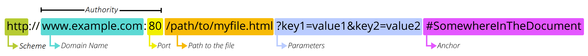

# Networking & HTTP for Web Developers

# Callback Review & Chaining
We use callbacks for :
  - modularity - we dont have to write the code over and over again.
  - reusability - we can reuse the functions.
  Callback chaining allows you to have nested functions that can feed results to each other.
  - Asynchronous - not returning values but instead use callback to passed the data.

# Error Handling
Try-catch blocks help us handle errors by letting us try something, and if it doesn’t work it will throw an error that will be caught.
error.name = Type Error
error..message = Assignment to constant variable.

Example:
```
let name = "John";
try {
  name = "Jane";
} catch (error) {
  console.log("There was an error ", error)
}
```

## Summary
we can use try-catch blocks to handle errors and use the error object in your code.

# Promise
A common use of Promises is when we want to run network requests to fetch data from APIs (e.g. information about the weather). We use .then, .catch, and .finally for when our Promise is fulfilled and for error handling.

Has 3 states:
- Pending
- Resolve
- rejected

behave as an object.

```
const myPromise = new Promise((resolve, rejected) => {

  const randNum = Math.random();

  if(randNum > 0.5) {
    resolve('success');
  } else {
    reject('failure')
  };
});

console.log(myPromise);

```


output:

```
// 50-50

Promise {<resolve> 'Success'}
```

or instead of console.log, use below

```
myPromise {
  .then((successString) => {
    console.log('Hello from .then! ' + successString);
    return 'Another string!';
  })
  .then((lastThenReturn)=> {
    console.log('Hello from SECOND .then! ' + lastThenReturn);
  })
  //.catch will handle any error in previous .then or the original promise
  .catch((failureString) => {
    console.log('Hello from .catch! ' + failureString);
  })
};
```
output:

```
// 50-50 output

Hello  from .then! Success
Hello from SECOND.then! Another string!

```

Promise.all() - to promise all the promises before .then or .catch if error persist

Promise.race() - return the first promise that completes then callback .then but still the other pending promises will continue.

## Conclusion
Promises help us both with handling errors and handling asynchronous functions. The Promises object in JavaScript can be either fulfilled, rejected, or pending. 

# Into to net

Net (net) is a module that is built into Node. It allows our Node apps to use TCP.

Example:

```
// Server.js

const net = require("net");//net allows our node apps to use TCP.
const server = net.createServer(); // start to implement or create a server.

let port = 3000;

server.on("connection", (client) => { // .on method listen for incoming connection.someone is now connected.
  
  console.log("New client connected"); // The server prints out New client connected!
  //OUTGOING
  client.write("Hello there!"); // .write method is writing data to the other party. Server send message to the client

  //INCOMING
  client.setEncoding("utf8"); // interpret data as text
  client.on("data", (data) => { // .on method - listen to the incoming data from other socket/party. The server prints out the data from the client. Receiving data from client.
    console.log("Message from client: ", data); //
  });

});

server.listen(port, () => { // .listen tells the server to turn "ON" and "listen".
  console.log(`Server is listening on port ${port}!`);
});

```

```
// CLient.js

const net = require("net"); //net allows our node apps to use TCP.

let port = 3000;

const conn = net.createConnection({ //creating a connection to our server using the port. client must follow the server port details to connect.
  host: "localhost",
  port: port, // same port with intend Server to connect to.
});

//INCOMING
conn.on("data", (data) => { // .on method - listen to the incoming data from other socket/party. The client prints out the data from the server. 
  console.log("Server says: ", data); // => Server says: Hello there!
});

//OUTGOING
conn.on("connect", () => { 
  conn.write("Hello from client!"); // client send a reply
});

conn.setEncoding("utf-8"); //interpret data as text

```

Output:
```
// Server
1. Server listening on port 3000!
2. New client connected!
3. Message from client: Hello from client!

// Client
1. Server says: Hello there!
```

## Conclusion

Client

- The client is always the one establishing the connection to the server. 
- All the client needs is the destination IP address and PORT information.

# Connect to the Server

## Events
When you connect to a server, or when it closes its connection with you, or when it sends you data, these are events. You can control how your client responds to these events if you know how to listen for them. If you don't listen for the event, you can't react to it.

## Event Handler
The conn object that Node gave you has everything you need to listen for events that occur on your connection. The code that defines what to do when an event occurs is often called an event handler.

The `.on` methods - lets you specify an event name and a function that does something when that event happens.

```
conn.on("event name", functionThatDoesSomething);
```

Syntax;
```
conn.on("event name", () => {
  // code that does something
});
```

The "event name" has to be a specific event name as defined by Node. For example, connect is a specific event that happens when a successful connection is made:

```
conn.on("connect", () => {
  // code that does something when the connection is first established
});
```

The "connect" event is triggered on a connection as soon as it is successfully established.

```
// Transmitting message to the sever from client. Sending a name.

  conn.on("connect", () => {
    conn.write("Name: RLM");
  });
```

Registering multiple callbacks for the same event is totally valid. They will be triggered in the sequence that they were registered.

Example:
```
// Connection Module. Script to establish a TCP connection and log incoming messages.

const net = require("net"); // net allows our node apps to use TCP.

let port = 50541;

// Establishes a connection to our intent game server
const connect = function() {
  
  const conn = net.createConnection({
    host: "localhost",
    port: port,
  });

  // Interpret incoming data as text
  conn.setEncoding("utf-8");

  // Handle incoming messages/data from the server. Event handler.
  conn.on("data", (data) => {
    console.log("Snake Host says: ", data);
  });

  // Connection event handler. Print message to the client screen when the connection is successfully established.
  conn.on("connect", () => {
    console.log("Successfully connected to game server");

    // Transmitting message to the sever. Sending a name.
    conn.write("Name: RLM");

    // Add multiple callbacks. Adding the supported move command by the game server.
    let time = 0;
    const movements = ["Move: up", "Move: left", "Move: up", "Move: right", "Move: right", "Move: down", "Move: down", "Move: right"];

    for (let movement of movements) {
      setTimeout(() => {
        conn.write(movement);
      }, time += 1000);
    }

  });

  return conn;
};

```


# HTTP & NodeJS

## HTTP Introduction

HTTP is an extensible protocol that is easy to use. The client-server structure, combined with the ability to add headers, allows HTTP to advance along with the extended capabilities of the Web.

Hypertext is text which contains links to other texts.

HTTP is a protocol used to read and write "resources" (data) in a simple text-based manner.

## HTTP Flow
HTTP is a request-response based protocol.

1. Open a TCP connection:
A client makes a request to an HTTP server
2. Send an HTTP message: 
sending a message asking for a specific resource
```
GET / HTTP/1.1
Host: developer.mozilla.org
Accept-Language: fr
```


The image is an example of HTTP request.

An <b>HTTP request</b> - A request has a method and a path, while a response does not.

An <b>HTTP response</b> - a response does not have a method and a path. The key element of a response is the status code.


3. Read the response sent by the server, such as:
the server sends down as a response
```
HTTP/1.1 200 OK
Date: Sat, 09 Oct 2010 14:28:02 GMT
Server: Apache
Last-Modified: Tue, 01 Dec 2009 20:18:22 GMT
ETag: "51142bc1-7449-479b075b2891b"
Accept-Ranges: bytes
Content-Length: 29769
Content-Type: text/html

<!DOCTYPE html>… (here come the 29769 bytes of the requested web page)
```


4. Close or reuse the connection for further requests.

## HTTP Methods or "verbs"

- GET: used to "get" some data from the server
- POST: usually used to create some new data
- PUT: generally used for editing existing data on the server
- DELETE: used to delete some existing data

## Paths and URL Structures
A URL (Uniform Resource Locator) is the address of a unique resource on the internet.



- Protocol /Scheme:

  indicates the protocol that the browser must use to request the resource (a protocol is a set method for exchanging or transferring data around a computer network).

- Domain (or Host)

  he domain indicates which Web server is being requested. Usually this is a domain name, but an IP address may also be used (but this is rare as it is much less convenient).

- Port

  indicates the technical "gate" used to access the resources on the web server.

- Resource Path

  `/path/to/myfile.html` is the path to the resource on the Web server.

- Query Parameters

  Those parameters are a list of key/value pairs separated with the & symbol. The Web server can use those parameters to do extra stuff before returning the resource. Each Web server has its own rules regarding parameters, and the only reliable way to know if a specific Web server is handling parameters is by asking the Web server owner.

- Anchor

  `#SomewhereInTheDocument` is an anchor to another part of the resource itself. An anchor represents a sort of "bookmark" inside the resource, giving the browser the directions to show the content located at that "bookmarked" spot.

## HTTP Responses

he response contains all kinds of useful information, but we'll look at two important bits here:

- Status Code:
  
  is a three-digit number that the server puts in the response to let the client know whether or not the operation was successful. 

  - 200: "Everything went great!"
  - 201: "The request has succeeded and a new resource has been created as a result."
  - 404: "Resource was not found."
  - 451: "Unavailable For Legal Reasons."
  - 500: "The server had an error."


- Body

  body will often contain webpages (HTML) or data encoded in JSON, which we'll learn about later on.

## Headers
Both requests and responses also let a programmer inject extra information into them as <b>"headers"</b>, which is a key-value way of storing data in a request or response. 

## Conclusion
- HTTP is a request-response protocol, where the client makes requests and the server sends responses
- HTTP is a text based protocol, making it easy to read and understand for humans
- HTTP requests must contain the verb/method (eg: GET) and the Path (eg: /about)
- HTTP requests aren't always to receive data, but sometimes to save data, like when we submit a form on a website. 

  This is done via a POST instead of a GET
- Requests and responses both contain key-value based headers (eg: Accept-Language: fr, Content-Type: text/html, etc.)


# HTTP uses TCP

Example:
```
/** 
 * SETUP
 * Our usual client setup code
 * Connect to example.edu website's HTTP server using our TCP library
 * HTTP servers typically run on port 80
 */
const net = require('net'); // net allows our node apps to use TCP.

// Establishes a connection to our intent destination
const conn = net.createConnection({ 
  host: 'example.edu',
  port: 80
});
conn.setEncoding('UTF8');

// Connection event handler. Print message to the client screen when the connection is successfully established.
conn.on("connect", () => {
  console.log("Connected to server!"); 

  // Transmitting message to the sever.
  conn.write(`GET / HTTP/1.1\r\n`); // We're presumably making a request for the / here (we could also specify /index.html for this server), using the HTTP 1.1 protocol. 
  conn.write(`Host: example.edu\r\n`);
  conn.write(`\r\n`);

  /** 
 * HTTP Response
 * After request is made, the HTTP server should send us HTTP data via our TCP connection
 * Print the data to the screen, and end the connection
 */
  // Event handler that handles server response, incoming data from the server.
  conn.on('data', (data) => {
    console.log(data);
    conn.end();
  });

});
```
run node <filename>

output:

```
rus@Rusgyns-Air net % node httpExample.js
Connected to server!
HTTP/1.1 200 OK
Age: 46941
Cache-Control: max-age=604800
Content-Type: text/html; charset=UTF-8
Date: Fri, 14 Jun 2024 07:44:25 GMT
Etag: "3147526947+ident"
Expires: Fri, 21 Jun 2024 07:44:25 GMT
Last-Modified: Thu, 17 Oct 2019 07:18:26 GMT
Server: ECAcc (nyd/D125)
Vary: Accept-Encoding
X-Cache: HIT
Content-Length: 1256

<!doctype html>
<html>
<head>
    <title>Example Domain</title>

    <meta charset="utf-8" />
    <meta http-equiv="Content-type" content="text/html; charset=utf-8" />
    <meta name="viewport" content="width=device-width, initial-scale=1" />
    <style type="text/css">
    body {
        background-color: #f0f0f2;
        margin: 0;
        padding: 0;
        font-family: -apple-system, system-ui, BlinkMacSystemFont, "Segoe UI", "Open Sans", "Helvetica Neue", Helvetica, Arial, sans-serif;
        
    }
    div {
        width: 600px;
        margin: 5em auto;
        padding: 2em;
        background-color: #fdfdff;
        border-radius: 0.5em;
        box-shadow: 2px 3px 7px 2px rgba(0,0,0,0.02);
    }
    a:link, a:visited {
        color: #38488f;
        text-decoration: none;
    }
    @media (max-width: 700px) {
        div {
            margin: 0 auto;
            width: auto;
        }
    }
    </style>    
</head>

<body>
<div>
    <h1>Example Domain</h1>
    <p>This domain is for use in illustrative examples in documents. You may use this
    domain in literature without prior coordination or asking for permission.</p>
    <p><a href="https://www.iana.org/domains/example">More information...</a></p>
</div>
</body>
</html>
```

below will show you the requested domain looks like.

<div>
    <h1>Example Domain</h1>
    <p>This domain is for use in illustrative examples in documents. You may use this
    domain in literature without prior coordination or asking for permission.</p>
    <p><a href="https://www.iana.org/domains/example">More information...</a></p>
</div>


## Conclusion

In this exercise we saw how it is possible to use the net module to make an HTTP request (of any kind, really) to any http server. While this is possible, we'll find that there are more purpose-built libraries in Node that help us do this in a more simple manner (yay!)

The reason we spent some time doing this exercise is to appreciate how HTTP is not alternative to TCP, but rather the text-based "language" that is used to communicate over a TCP connection. This means that every time our browser accesses a website, it makes an HTTP request by opening a TCP connection on port 80 (or 443 for https) to a given HTTP server's IP address. It then sends text-based commands such as GET /path-to-page HTTP/1.1\r\n along with many other request headers (such as the user agent string, etc.) and waits for a response from the server. The response could be any type of document, which typically is either HTML, CSS, or JS.

# Using `needle` Library

`needle` module makes HTTP requests easy. Behind the scenes, it uses http which in turn uses net, in the way that we did recently.

`needle` is simple to get started with but it is also quite powerful and advanced.

We use `needle` which uses good Node practice by fetching our results asynchronously. Therefore, our fetch function also needs to be asynchronous. It should therefore accept a callback.

One thing to note is that the `needle` function's callback provides the response body already parsed as a JavaScript object when the response is JSON. So, when you're extracting the IP address from the body, you can directly access it as body.ip.


## Installation
```
npm init

npm install needle
```

Example:

```
const needle = require('needle');

needle.get('http://www.google.com', (error, response, body) => {
  console.log('error:', error); // Print the error if one occurred
  console.log('statusCode:', response && response.statusCode); // Print the response status code if a response was received
  console.log('body:', body); // Print the HTML for the Google homepage.
});
```

See [page-downloader](https://github.com/Rusgyn/page-fetcher) that uses needed to connect to the browser and download the content.

## Conclusion

Making HTTP requests in Node using libraries like `needle` is even easier than managing and using TCP connections.

# JSON

JSON (JavaScript Object Notation) is a data format that underpins many modern web services, a subset of the JavaScript language.

a way to convert objects into text
JSON is a subset of JavaScript that allows string-representation of objects


## The Official definition:

JSON is built on two structures:
- A collection of name/value pairs
- An ordered list of values

An object encoded using JSON looks like this:
```
{
  "name": "New York City",
  "boroughs": [
    "Manhattan",
    "Queens",
    "Brooklyn",
    "The Bronx",
    "Staten Island"],
  "population": 8491079,
  "area_codes": [212, 347, 646, 718, 917, 929],
  "position": { "lat": 40.7127, "lng": -74.0059 }
}
```
Note: 
1. keys are always double-quoted "strings"
2. values can be numbers, strings, or objects themselves.

Note
The JSON syntax is (and must be) valid JavaScript.

## Serialization:
Process that converts Object (data srtucture) into a format that can be stores or transmitted between computers (typically as a STRING of TEXT)

DEserialization - is the opposite.

Javascript uses JSON object for serializing and deserializing.

### JSON..parse()
string to object

Parse a string as JSON, optionally transform the produced value and its properties, and return the value.

### JSON.stringify()
object to string

Return a JSON string corresponding to the specified value, optionally including only certain properties or replacing property values in a user-defined manner.

Example:

```
const jsonString = '{"a":1, "b":2, "foo":"bar"}'; // string version of a JS Object
jsonString // a string, of course :)
```
output:
```
'{"a": 1, "b":2, "foo":"bar"}'
```

Convert the string into an object, by "parsing" it:
```
const obj = JSON.parse(jsonString);
obj 
```
output:
```
{ a: 1, b: 2, foo: 'bar' }
```
Modify the object:
```
delete obj.foo;
obj
```
output:
```
{ a: 1, b: 2 }
```
Serialize it back to a string:
```
JSON.stringify(obj);
```
output:
```
'{"a":1,"b":2}'
```
The last output is now serialized that can be stored or transmitted between computers.

### JSON > XML
Before JSON became popular (thanks Doug!), as he mentions, XML was the popular standard format for exchanging data.

### JSON is language independent
We see it used heavily in other programming languages/ecosystems such as Python, Ruby, C#, Java, Golang, Rust, etc.

## Conclusion
Since objects are an easy way to store key-value data, we learned about how this JavaScript Object Notation is used to store configuration/setting information in files (such as package.json) and how we can easily use two methods on the JSON object to convert between actual object and string representation of that data.

JSON requires quotes around the keys. This is the main and subtle difference between objects in JS and JSON.

JSON can definitely include arrays.

we can nest object in JSON

JSON does not care about whitespace


# API
APIs (Application Programming Interface) - allows systems to work together.

software to talk to each other

Set of requirements that govern how one application can talk to another. 

The description is fetched via an <b>API</b> request, which is network I/O. 
We use `needle` which uses good Node practice by fetching our results asynchronously. Therefore, our fetch function also needs to be asynchronous. It should therefore accept a callback. 

# Promise

<b>Promise</b> is the best way to solve asynchronous code. Any code that relies on network requests, events, threads, or some kind of unknowable time is asynchronous.

Asynchronous means - happens unknown or unpredictable time.

A promise represents the eventual result of an asynchronous operation. The primary way of interaction with a promise is through its then method, which registers callbacks to receive either a promise’s eventual value or the reason why the promise cannot be fulfilled.

- A promise is an object
- Promises do not rely on anything other than basic JavaScript
- As of ES6, JavaScript has promises supported natively in its code. In other words, they are built into the language (via Promise)

## There's more to promises

There's more to promises than just avoiding nested callbacks, such as:

1. Error handling becomes much simpler with promises
2. Promises make asynchronous code easier to unit test
3. Promise.all (introduced by MPJ's video) can be used to run multiple async operations in parallel and have a single callback to see all the results together
4. And more ...