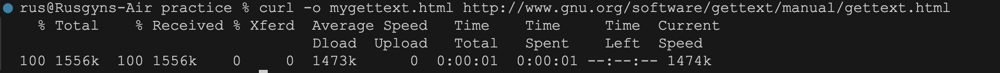
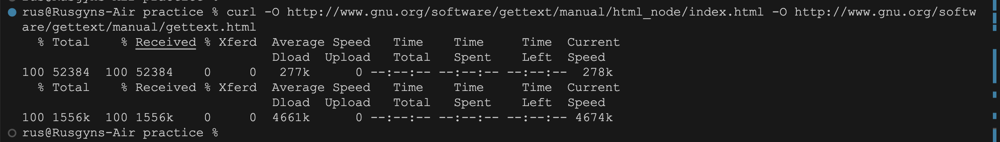

# NOTES-WEEK-6

GET - cannot give body. To retrieve something.
We type the url in the browser address bar.

POST - can only provide body content
After the url browser address request, the content of the URL is the body (process is called POST).

### Response
* status code
  * 404 page not found
  * 401 not authorized
  * 200 okay
  * 500 server error
  * 1xx routing codes
  * 2xx everything is okay
  * 3xx redirection
  * 4xx client made a mistake
  * 5xx something wrong with the server

  Visit `https://http.cat/` to see status code with cats image.

  # ExpressJS
  Fast, unopinionated, minimalist web framework for Node.js.

  opinionated - the library itself is going to dictate to you this is the correct structure.

  unopinionated - don't have any opinion. The library doesn't make any style for you.

## middleware
syntax
<express() variable name>.use((req, res,next) => {

next(); // means i'm done. call next middleware or next route handler.
});


# CRUD

app.get('/combo/:id', (req, res) => {

})
the `:id` means accept all.

type in the browser
localhost:9001/combo/canyouseethis?

req.params - the params is equal to `{id: canyouseethis?}`

req.params.id = canyouseethis?

what is restful
Get request
post request
put request
patch request
delete request

<input type = "text" name="something else">

name is very important, if you have input always have name

# Promises

<b>Promise</b> is the best way to solve asynchronous code. Any code that relies on network requests, events, threads, or some kind of unknowable time is asynchronous.

## Promises Vs callbacks

<b>Callbacks</b>

By default Javascript uses callbacks to handle asynchronous work. This is when you parse a function into another function as an argument.

Using callbacks, it is hard to handle errors. It also becomes harder to follow the sequence.

  ```
  function loadImage (src, parent, callback){
   let img = document.createElement('img')
   img.src = src
   img.onload = callback
   parent.appendChild(img)
  }

  // Pyramid Of Doom with callbacks

  loadImage('above-the-fold.jpg', imgContainer, function(){
    loadImage('just-below-the-fold.jpg', imgContainer2, function(){
        loadImage('farther-down-the-fold.jpg', imgContainer3, function(){
            loadImage('abstract-art.jpg', imgContainer4, function(){
                loadImage('last-one.jpg', imgContainer5)
            })
        })
    })
  })
  ```

<b>Promises</b>

it becomes easier

  ```
  const sequence = get('example.json')
  .then(doSomething)
  .then(doSomethingElse);
  ```

### There are four stages in creating Promises:

1. Wrapping (syntax, or the Promise structure)

2. Thening (when it works) - .then

3. Catching (recovery, when there's an error)

4. Chaining (where you create long sequences of asynchronous work)


### Four states of a Promise:

1. Fulfilled (it worked!)

2. Rejected (failed)

3. Pending (still waiting...)

4. Settled (something happened)

## Error Handling

1. Using .catch
  ```
  get('example.json')
  .then(resolveFunc)
  .catch(rejectFunc)
  ```

2. Chaining a second .then to handle the error
  ```
  get('example.json')
  .then(resolveFunc)
  .then(undefined, rejectFunc)
  ```

# Command Line cURL

`cURL` is a command line utility that is used to make HTTP requests to a given URL and it outputs the response. It allows you to see the URL.

curl is used in command lines or scripts to transfer data. 

1. Download a single file

Example:

```
> curl http://www.centos.org
```

Output:
```
<!DOCTYPE HTML PUBLIC "-//IETF//DTD HTML 2.0//EN">
<html><head>
<title>302 Found</title>
</head><body>
<h1>Found</h1>
<p>The document has moved <a href="https://www.centos.org/">here</a>.</p>
</body></html>
```

2. Save the cURL Output to a file

- -o (lowercase o) the result will be saved in the filename provided in the command line
- -O (uppercase O) the filename in the URL will be taken and it will be used as the filename to store the result

```
curl -o mygettext.html http://www.gnu.org/software/gettext/manual/gettext.html
```
Output:


Note: A new folder name mygettext.html is created, and saved to current folder.

```
rus@Rusgyns-Air practice % ls -al
total 3120
drwxr-xr-x  3 rus  staff       96 Jun 24 08:18 .
drwxr-xr-x  3 rus  staff       96 Jun 24 08:14 ..
-rw-r--r--  1 rus  staff  1594070 Jun 24 08:18 mygettext.html

```

3. Fetch multiple files at a time

Syntax:

```
> curl -O URL1 -O URL2
```

Example:

will download both index.html and gettext.html and save it in the same name under the current directory.

```
curl -O http://www.gnu.org/software/gettext/manual/html_node/index.html -O http://www.gnu.org/software/gettext/manual/gettext.html
```

Output:



Note: A new file is created

```
rus@Rusgyns-Air practice % ls -al
total 6344
drwxr-xr-x  5 rus  staff      160 Jun 24 08:22 .
drwxr-xr-x  3 rus  staff       96 Jun 24 08:14 ..
-rw-r--r--  1 rus  staff  1594070 Jun 24 08:22 gettext.html
-rw-r--r--  1 rus  staff    52384 Jun 24 08:22 index.html
-rw-r--r--  1 rus  staff  1594070 Jun 24 08:18 mygettext.html
```

4. Follow HTTP Location Headers with -L option

Note:
when someone types google.com in the browser from India, it will be automatically redirected to ‘google.co.in’. This is done based on the HTTP Location header as shown below.

```
> curl http://www.google.com
```

Output:
```
<TITLE>302 Moved</TITLE>
<H1>302 Moved</H1>
The document has moved
<A HREF="http://www.google.co.in/">here</A>
```

We can insists curl to follow the redirection using -L option, as shown below. Now it will download the google.co.in’s html source 

```
> curl -L http://www.google.com
```


5. Continue/Resume a Previous Download

Using curl -C option, you can continue a download which was stopped already for some reason. This will be helpful when you download large files, and the download got interrupted.

```
> curl -O http://www.gnu.org/software/gettext/manual/gettext.html

##############             20.1%

```
NOte: # display download in progress

Now the above download was stopped at 20.1%. Using “curl -C -“, we can continue the download from where it left off earlier. Now the download continues from 20.1%.

```
> curl -C - -O http://www.gnu.org/software/gettext/manual/gettext.html
###############            21.1%
```

6. Limit the rate of data transfer
```
> curl --limit-rate 1000B -O http://www.gnu.org/software/gettext/manual/gettext.html
```

7. Download a file only if it is modified before/after the given time.

```
> curl -z 21-Dec-11 http://www.example.com/yy.html

```

Note:
The above command will download the yy.html, if it is modified before than the given date and time.

8. Pass HTTP Authentication in cURL

websites will require a username and password to view the content ( can be done with .htaccess file ). With the help of -u option, we can pass those credentials from cURL to the web server as shown below.

Syntax:
```
> curl -u username:password URL
```

# Domain Name System
is a hierarchical and distributed name service that provides a naming system for computers, services, and other resources on the Internet or other Internet Protocol (IP) networks
# DNS Resolution
Root Server > (TLD) Top Level Domain > Authoritative Server > Resolving Server

## Record Types

- A: most common; map a hostnames to IP address (IPv4, 32-bit address)
- NS: Name Server that is responsible for a DNS zone
- MX: Mail Exchange record specifies where email gets sent to
- CNAME: Canonical Name, an alias for another hostname
- AAAA: similar to A, but uses IPv6, 128-bit address

# Digging DNS

`dig` makes iterative queries to resolve the name being looked up. It will follow referrals from the root servers, showing the answer from each server that was used to resolve the lookup.

```
> dig +trace google.com
```

# Express

- express is a middleware
- is a minimal and flexible Node.js web application framework that provides a robust set of features for web and mobile applications
- we can skip a lot of the boilerplate code
- good practice for readability, as well as taking up less development time. good at this job that it has been called the “de facto standard server framework”.

## Installation
- check if you have node by running 
```
node -v
```
- if node already installed, install express via npm
```
npm install express --save
```
otherwise, install node first then express


To verify express installation:
```
> npm list express
```

## The code

This is all of the boilerplate that Express needs!

```
// server.js file

const express = require("express"); // Import the express library

const app = express(); // Define our app as instance of express

const port = 3000; //Define our base URL as http://localhost:3000

app.listen(port, () => {

  console.log(`Server running on port ${port}`); // Tell yourself the port number to prevent mistakes in the future.

});
```

In your terminal type below and press enter. you will officially be running a server.
```
> node server.js
```

# Template Engine

What is templates?
Templates are files that define the presentation of a web app's data separately from the server logic.

## Why are templates helpful?
- Keeping server logic separate from markup HTML making it easier to debug
- Separating diff parts of HTML doc into diff files, helping the length of HTML files short and manageable

## Template engines

Template engine is needed to use template files.
Replaces variable in a template file with actual data and transforms the template into an HTML file sent to the client (browser)

Template engines like:
- Mustache
- Handlebars- Nunjucks
- pug
- Embedded JavaaScript (EJS)

Click [EJS demo](https://www.digitalocean.com/community/tutorials/how-to-use-ejs-to-template-your-node-application) to practice.

Note:
- res.render() will look in a views folder for the view

Use <%- include('RELATIVE/PATH/TO/FILE') %> to embed an EJS partial in another file.

The hyphen <%- instead of just <% to tell EJS to render raw HTML.
The path to the partial is relative to the current file.

## views

EJS (template engine) automatically knows to look inside the `views` directory for any tepmlate files that have the extension .ejs. t also means that we do not need to include the extension of the filename when referencing it.

When sending variables to an EJS template, we need to send them inside an object, even if we are only sending one variable. This is so we can use the key of that variable (in the below case the key is greeting) to access the data within our template.

Example: 
```
app.get("/hello", (req, res) => {

  const templateVars = {
    greeting: "Hello World!"
    };

  res.render("hello_world", templateVars);

});
```

Output:

```
<!-- This would display the string "Hello World!" -->

<h1><%= greeting %></h1>
```

Note:
By using the 
1. <%= %> syntax, we tell EJS that we want the result of this code to show up on our page. 
2. <% %> syntax, we would like to run some code without it displaying on the page

Example:

```
<!-- This line will not show up on the page -->

<% if(greeting) {%>

<!-- This line will only show if greeting is truthy -->

<h1><%= greeting %></h1>
<% }%>

```

## Route path
```
app.get('/', (req, res) => {
  res.send('root')
})
```
```
app.get("/hello", (req, res) => {

  const templateVars = {
    greeting: "Hello World!"
    };

  res.render("hello_world", templateVars);

});
```

## Route parameters

The end point for such a page will be in the format /urls/:id. The : in front of id indicates that id is a route parameter. This means that the value in this part of the url will be available in the req.params object.

For example, if the id of a shortened URL was b2xVn2, then the path to access it would look like /urls/b2xVn2 in the browser. Further, the value of req.params.id would be b2xVn2.

Route parameters are named URL segments that are used to capture the values specified at their position in the URL. The captured values are populated in the req.params object, with the name of the route parameter specified in the path as their respective keys.

```
app.get('/users/:userId/books/:bookId', (req, res) => {
  res.send(req.params)
})
```

Route path: /users/:userId/books/:bookId
Request URL: http://localhost:3000/users/34/books/8989
req.params: { "userId": "34", "bookId": "8989" }

## Header Partial

<b>Partial templates, or partials</b>, - can keep our code DRY by avoiding repetition of elements on the same page (like list items) or across different pages (like headers or footers).

syntax:

```
<%- include('LOCATION/OF/YOUR/PARTIAL/FILE.EJS') %>
```

# CONCLUSION
We used the Express render method to respond to requests by sending back a template, along with an object containing the data the template needs. We then used EJS to render this data to our web page. We used Express route parameters to pass data from our frontend to our backend via the request url. Finally, we created a partial template for our header so that we can have the code for it in one location, but render it on multiple pages.

# CRUD and HTTP

## CRUD

- Create - add new record
```
users["5315"] = {first_name: "John", last_name: "Smith"}
```
- Read - Retrieve the value of a record
```
users["5315"]
```
- Update - Update a record's file
```
users["5315"].first_name = "Jane"
```
- Delete - Delete a record
```
delete users["5315"]
```

## HTTP
HTTP was designed around the concept of resources (described by URLs) and actions that can be taken on them. To take an action on a resource, a client (for example, a browser) sends an HTTP request to a server with the appropriate URL and method.

- GET - Read in CRUD
- POST - Create in CRUD
- PUT - Update in CRUD
- DELETE - Delete in CRUD

<b>Safe Methods: </b> 

A request method is safe if a request with that method has no intended effect on the server. The methods GET, HEAD, OPTIONS, and TRACE are defined as safe. In other words, safe methods are intended to be read-only.

<b>Idempotent methods</b>

A request method is idempotent if multiple identical requests with that method have the same effect as a single such request. The methods PUT and DELETE, and safe methods are defined as idempotent. Safe methods are trivially idempotent, since they are intended to have no effect on the server whatsoever; the PUT and DELETE methods, meanwhile, are idempotent since successive identical requests will be ignored.

GET - 
The GET method requests a representation of the specified resource. Requests using GET should only retrieve data.

    Syntax:

    GET /index.html

POST - 
The POST method submits an entity to the specified resource, often causing a change in state or side effects on the server.

    Syntax:

    POST /test

POST request has a body, while a GET request does not.

PUT - 
The PUT method replaces all current representations of the target resource with the request payload.

    Syntax:

    PUT /new.html HTTP/1.1

DELETE - 
The DELETE method deletes the specified resource.

    Syntax:
    
    DELETE /file.html HTTP/1.1


### POST request

POST request has a body, while a GET request does not.

The HTTP POST method sends data to the server. The type of the body of the request is indicated by the Content-Type header.

When our browser submits a POST request, the data in the request body is sent as a <u><b>Buffer</b></u>. 

While this data type is great for transmitting data, it's not readable for us humans. To make this data readable, we will need to use another piece of middleware which will translate, or parse the body. This feature is part of Express.

```
app.use(express.urlencoded({ extended: true }));
```

Express's built-in middleware function `urlencoded` will convert the request body from a `Buffer` into string that we can read. It will then add the data to the `req`(request) object under the key `body`.

This needs to come before all of our routes. Why is this?


# cookie-parser

- serves as Express middleware that facilitates working with cookies
- helps us read the values from the cookie
- We will still need to set a cookie using res.cookie


<b>Request</b>
request.cookies

<b>Response</b>
response.cookie


