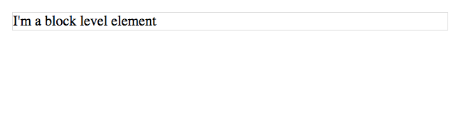
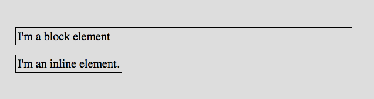
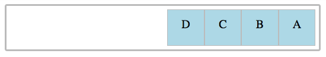
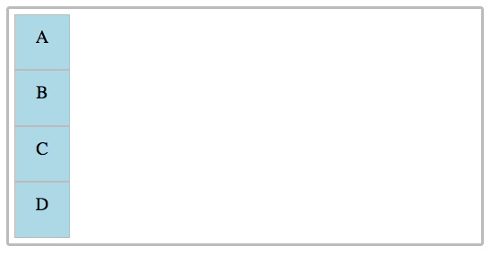

# Stack

What is Stack? Stack often refers to the collection of technologies used in a given system.

TinyApp Project has the following stack
- Web Server: [Node.js](https://nodejs.org/en/learn/getting-started/introduction-to-nodejs)
- Middleware: [Express](https://expressjs.com/en/guide/using-middleware.html)
- Template Engine: [ejs](https://www.geeksforgeeks.org/what-is-ejs-and-why-do-i-need-it/)
    - EJS or Embedded JavaScript is a template engine for JavaScript that is used for web development which allows users to generate dynamic HTML markup using JavaScript code within HTML templates.
- Database: None, just memory on object.

can be
- Hosting/Infrastructure: Railway.app

# HTML and CSS - Basic Intros
HTML and CSS interact through a tree-like structure called the Document Object Model (DOM).

## Basic Elements

- `<html>` - represents the root of an HTML document
- `<head>` - provides general information (metadata) about the document
- `<title>` - defines the title of the document, shown in a browser's title bar
- `<link>` - specifies relationships between the current document and an external resource
- `<body>` - represents the content of an HTML document
- `<h1>, <h2>, ...` -  Heading elements implement six levels of document headings
- `<p>` - represents a paragraph of text
- `<div>` - Division Element, generic container for flow content
- `<ol>, <ul>` - list of items with, or without numerical ordering
- `<li>` - represents an item in a list
- `<a>` - anchor element; defines a hyperlink to a location or page on the Web
- `<table>` - display a data table. Note: not to be used for layout
- `<tr>` - a table row
- `<td>` - a cell in a table row

## Styling with CSS
1. Directly to an element. 
  
      For example: 
      ```
      <p style="color: red"> This TEXT is now color red </p>
      ```

2. Inline with HTML using a `<style>` tag. `<style>` tags usually go inside the `<head>` tag.

    An example is: 
    
    ```
    <style> 
      p { 
        color: red;
      } 
    </style>
    ```

3. Linking to a CSS file using a `<link>` tag. The parent of `<link>` tag is `<head>`
  
    Here is an example of that tag: 
    
    ```
    <link rel="stylesheet" href="style.css">
    ```

# CSS
CSS (Cascading Style Sheets) is a separate language which specifies a page’s appearance.

## Specificity
[Specificity](https://www.smashingmagazine.com/2007/07/css-specificity-things-you-should-know/) essentially determines how CSS rules are prioritized when rendering a page.

The different weight of selectors is usually the reason why your CSS-rules don’t apply to some elements, although you think they should have. In order to minimize the time for bug hunting you need to understand, how browsers interpret your code. And to understand that, you need to have a firm understanding on how specificity works.

### [CSS Specificity: An Overview](https://www.smashingmagazine.com/2007/07/css-specificity-things-you-should-know/)
1. Specificity determines, which CSS rule is applied by the browsers.
2. Specificity is usually the reason why your CSS-rules don’t apply to some elements, although you think they should.
3. Every selector has its place in the specificity hierarchy.
4. If two selectors apply to the same element, the one with higher specificity wins.
5. There are five distinct categories which define the specificity level of a given selector: inline styles, IDs, classes, attributes, and elements.
6. You can understand specificity if you love Star Wars: CSS Specificity Wars.
7. You can understand specificity if you love poker: CSS Specificity for Poker Players
8. When selectors have an equal specificity value, the latest rule is the one that counts.
9. When selectors have an unequal specificity value, the more specific rule is the one that counts.
10. Rules with more specific selectors have a greater specificity.
11. The last rule defined overrides any previous, conflicting rules.
12. The embedded style sheet has a greater specificity than other rules.
13. ID selectors have a higher specificity than attribute selectors.
14. You should always try to use IDs to increase the specificity.
15. A class selector beats any number of element selectors.
16. The universal selector and inherited selectors have a specificity of 0, 0, 0, 0.
17. You can calculate CSS specificity with CSS Specificity Calculator.

# IDs vs Class

As a general rule, classes should be used much more frequently than IDs.

<strong><u>IDs</u></strong> - are used to identify unique elements on a page,

We target elements by ID from CSS using a selector with a hashtag prefix: `#buy-now-main-btn`. We only expect to find 0 or 1 elements that match this selector. 

An element can only have <strong>one ID</strong>, but it can have many classes.

<strong><u>Classes</u></strong> - are used to identify elements of the same type.

We target elements by class using a selector with a period/dot prefix: `.nav-item`. We expect to find 0 to n elements that match this selector, and these elements can occur anywhere.

### Q: So when do I use IDs, exactly?

IDs may be used when you have a unique element such as a call to action that is styled and/or behaves very differently than other elements on a page or website.

IDs also need be used when you need to reference them from the URL using the anchor hash value (also called the page fragment). Eg: http://yourdomain.com#comments will jump to the element with ID comments.

# [Flexbox](https://web.compass.lighthouselabs.ca/p/web-flex-2/workbooks/web-flex-v2-m04w8/activities/925?journey_step=25)

# Display
## display: block
- A block level element will take up the entire space of its parent element. It can contain other block elements or inline elements.
- we can add a width, height, padding or margin to inline elements. 

  Example:

  ```
  <p>
  I am a block element
  </p>
  ```

  The block element will stretch all the way across its parents

  

Other block elements include:

- headings (<h1>, <h2>, <h3>,<h4>,<h5>,<h6>)
- div (<div>)
- section (<section>)
- footer (<footer>)
- article (<article>)
- paragraph (<p>)
- lists (<ul>, <ol>)
- nav (<nav>)

## display: inline
- Inline elements do not start a new line when they are rendered in the browser.

- we can't add a width, height, padding or margin to inline elements. They simply take up as much room as they need to display their content. No more, and no less.


  Example:
  ```
  <span>
  I am an inline element
  </span>
  ```

  When we compare a block element (the paragraph) to an inline element, the size difference becomes apparent.

  

Other inline elements include:
- anchor `<a>`
- em `<em>`
- strong `<strong>`
- span `<span>`

## display: inline-block
- An inline-block element has, as you might have guessed, properties of both. It doesn't automatically create a new line in the browser, but it can have a margin, padding, height, and width.

- Image tags `` and buttons `<button>` are the only two HTML tags who have a default inline-block display property.

## display: flex
- Flexbox (also known as CSS Flexible Box) is a layout module in CSS. It allows us to specify how elements on our page should appear. It is great for layouts that need to adapt to different screen sizes and display devices.

- To start using Flexbox, we add the `display: flex` property to the <strong><u>parent</u></strong> element.

  Example:
  ```
  //HTML
    <section class="parent">
      <div class="a">A</div>
      <div class="b">B</div>
      <div class="c">C</div>
      <div class="d">D</div>
    </section>
  ```

  ```
  //css
    .parent {
      display: flex;
    }
  ```

### parent properties
- The parent element is also sometimes referred to as the container element.

1. flex-direction
    - Defines the direction that the children (also know as flex items) will appear in
      - row (the default), the main axis is horizontal;
      - columns, it will be vertical.

      - row: Items are placed the same as the text direction.
      - row-reverse: Items are placed opposite to the text direction.
      - column: Items are placed top to bottom.
      - column-reverse: Items are placed bottom to top.

      Example:
      ```
      .parent {
        display: flex;
        flex-direction: row;
      }
      ```
      Output:
      

            Example:
      ```
      .parent {
        display: flex;
        flex-direction: column;
      }
      ```

      Output:
      

Some other parent properties include:

2. justify-content, determines where the flex items are along the main axis. (x axis)

    - flex-start: Items align to the left side of the container.
    - flex-end: Items align to the right side of the container.
    - center: Items align at the center of the container.
    - space-between: Items display with equal spacing between them.
    - space-around: Items display with equal spacing around them.

3. align-items, determines how flex items are laid out on the cross axis. (Y axis)

    - flex-start: Items align to the top of the container.
    - flex-end: Items align to the bottom of the container.
    - center: Items align at the vertical center of the container.
    - baseline: Items display at the baseline of the container.
    - stretch: Items are stretched to fit the container.

### child properties

- `order`, which controls the order elements appear in without changing your HTML (its default value is 0)

By default, items have a value of 0, but we can use this property to also set it to a positive or negative integer value (-2, -1, 0, 1, 2).


- `flex-grow`, dictates how much space a flex item should take up.

# Client Side JS
## Client-Side JavaScript
- is asynchronous and makes extensive use of callback functions. Deals with users-generated event and interacts with DOM
 
# the DOM
 Document Object Model - When a page is loaded for uses to see, the browser is running a process that created DOM in memory to represent all of the HTML code on that page. Each element is also called "Node"

# Event-Driven Architecture (EDA)
When X happens, then do Y
X is the event, and Y is the event handler. E.g. Event X is a click of a button, and Handler Y turn on a lightbulb.

## Client - Side Events
On the client side (browser)we have the DOM which has events such as OnClick, OnFocus, onLoad, as well as custom events.

## Server - side Events - Example: TinyApp
On a server running a Node.js you can think of an incoming a request as an events, with a callback function that handles the event( and could render a response )
The Node.js core API provides an EventEmitter class that is basic for event driver patterns.

# Event Propagation
## [Bubbling and Capturing](https://javascript.info/bubbling-and-capturing)
event.stopImmediatePropagation()
If an element has multiple event handlers on a single event, then even if one of them stops the bubbling, the other ones still execute.

In other words, event.stopPropagation() stops the move upwards, but on the current element all other handlers will run.

To stop the bubbling and prevent handlers on the current element from running, there’s a method event.stopImmediatePropagation(). After it no other handlers execute.

## Capturing

DOM evnets describes 3 phases of event propagation
1. Capturing phase - the event goes down to the element
2. Target phase - the event reached the target element
3. Bubbling phase - the event bubbles up from the element.

In fact, the capturing phase was invisible for us, because handlers added using on<event>-property or using HTML attributes or using two-argument addEventListener(event, handler) don’t know anything about capturing, they only run on the 2nd and 3rd phases.

To catch an event on the capturing phase, we need to set the handler capture option to true:

# jQuery
## Why does jQuery exist?
1. Fixes Browser compatibility issues

    pure javascript
    ```
    const getViewPortWidth = function() {
      let IEDocument = document.documentElement;
      if(window.innerWidth) {
        return window.innerWidth;
      } else if(IEDocument.clientWidth) {
        return IEDocument.clientWidth;
      } else if(IEDocument.getElementsByTagName('body')[0]) {
        return IEDocument.getElementsByTagName('body')[0].clientWidth;
      }
    }
    const viewportWidth = getViewPortWidth()
    ```

    Why the craziness? Because while most browsers have a function called window.innerWidth, Internet Explorer uses document.documentElement.clientWidth to return the viewport width. If you tried to run window.innerWidth in Internet Explorer you would get an error.


    jQuery
    ```
    $(window).width()
    ```

2. Cleaner API

  Example:
    html
    ```
    <html>
      <head>...</head>
      <body>
        <span id="foo">Click me to open an alert!</span>
      </body>
    </html>

    ```

    javascript to pop up an alert when the user clicks the span element
    ```
    const element = document.getElementById("foo");
    element.addEventListener("click", function() {
      alert("Clicked!");
    });
    ```

    Working with DOM events can be a bit painful. getElementById and addEventListener are quite the mouthful.

    jQuery
    ```
    $("#foo").on( "click", function() {
      console.log("Foo element clicked");
    });
    ```

    or

    ```
    $("#foo").click(function() {
      console.log("Foo element clicked");
    });
    ```

# DOM Events
Good source to read all about DOM events.

[DOM Events](https://www.smashingmagazine.com/2013/11/an-introduction-to-dom-events/)

[More Events reference](https://developer.mozilla.org/en-US/docs/Web/Events)

